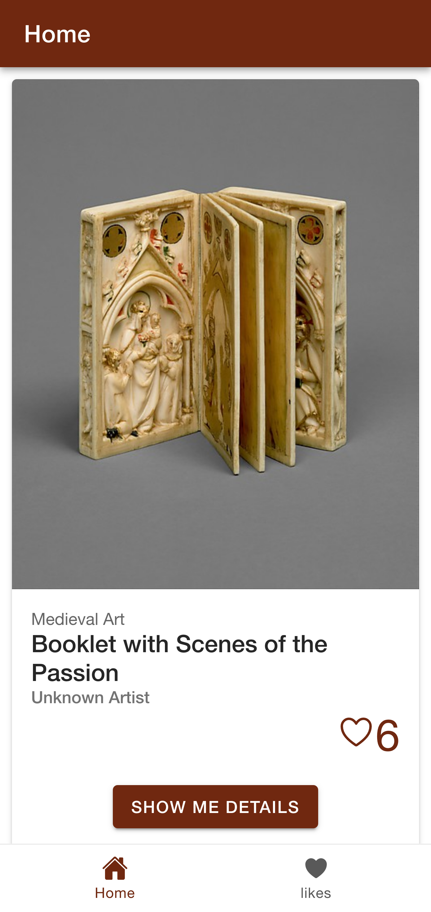
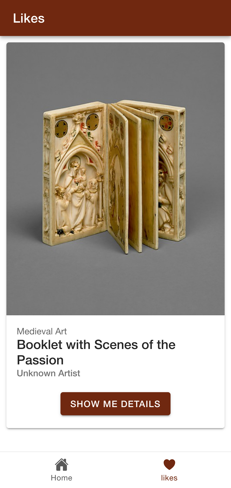

# project description 

The project idea is to build a mobile app(ionic) to display the art object using [The Metropolitan Museum of Art APIs](https://metmuseum.github.io/)

### sample project 
-  https://github.com/indigodavid/metropolitan-museum-of-art?tab=readme-ov-file

## screenshot 
- home page :

- like page :

